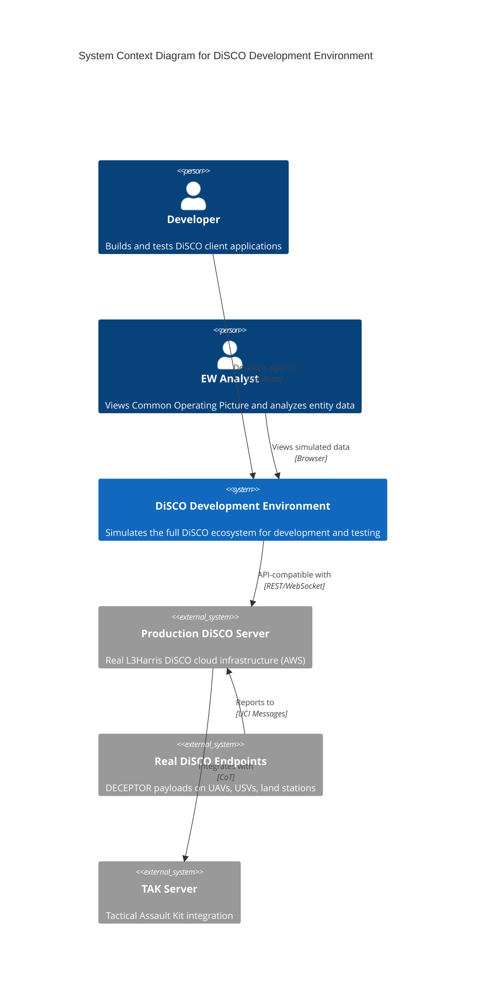
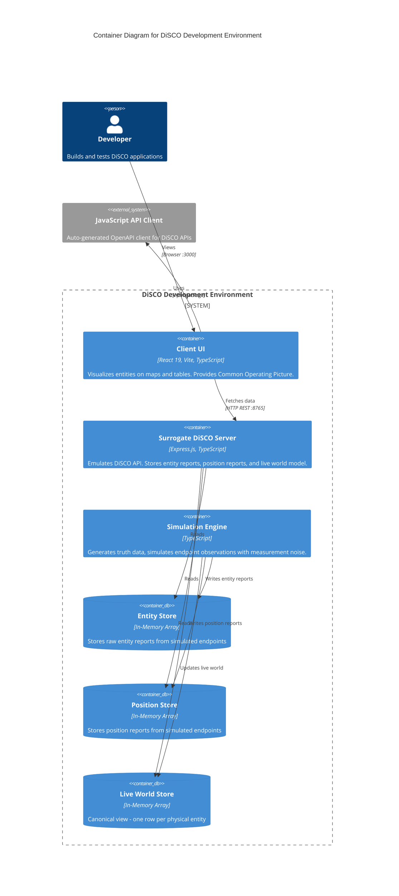
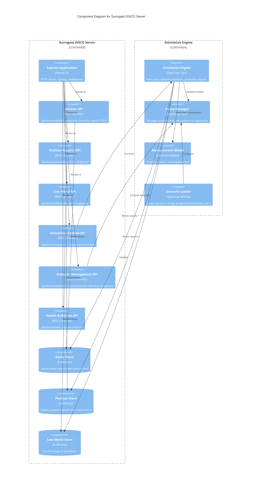
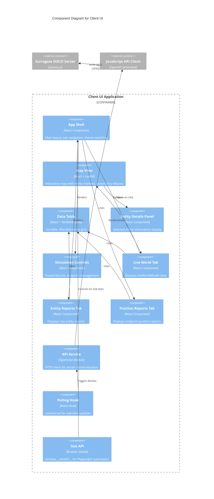
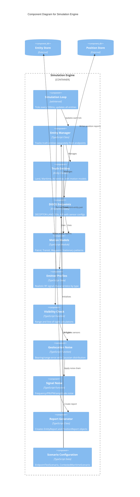
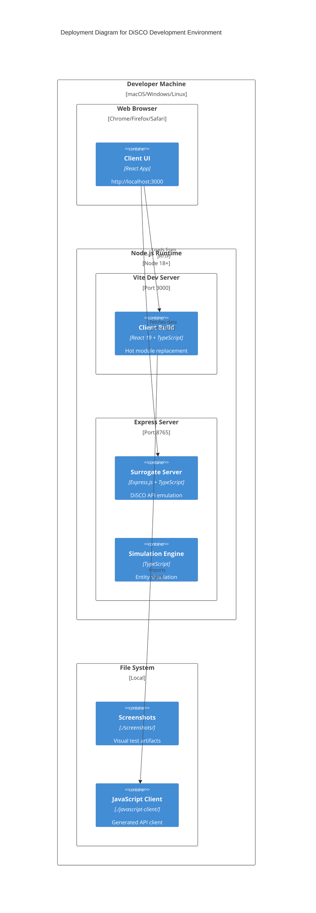

# DiSCO C4 Architecture Diagrams

C4 model diagrams showing the DiSCO development environment at four levels of abstraction.

## Level 1: System Context Diagram

Shows DiSCO in its broader context - the people who use it and the systems it interacts with.

## Level 2: Container Diagram

Shows the high-level technology choices and how the containers communicate.

## Level 3: Component Diagram - Surrogate Server

Shows the internal components of the Surrogate DiSCO Server.

## Level 3: Component Diagram - Client UI

Shows the internal components of the Client UI application.

## Level 3: Component Diagram - Simulation Engine

Shows the internal components of the Simulation Engine in detail.

## Deployment Diagram

Shows how the system is deployed for local development.

## Summary: C4 Levels

| Level | Diagram | Audience | Shows |
|-------|---------|----------|-------|
| **1 - Context** | System Context | Everyone | DiSCO dev environment in relation to real DiSCO and users |
| **2 - Container** | Container | Developers | Major technology blocks and their interactions |
| **3 - Component** | Component (x3) | Developers | Internal structure of Server, Client, and Simulation |
| **4 - Code** | (See ERD) | Developers | Data structures and relationships |

## Key Architectural Decisions

1. **Separate Truth from Observations**: The simulation maintains "truth data" (actual entity positions) separate from "observations" (what endpoints report with noise)

2. **API Compatibility**: The surrogate server implements the same REST API as production DiSCO, enabling seamless transition to real infrastructure

3. **In-Memory Storage**: Development uses in-memory arrays instead of a database for simplicity and fast iteration

4. **Measurement Model Abstraction**: Visibility checks and noise models are isolated, making it easy to tune sensor characteristics

5. **Component Isolation**: Clear boundaries between UI, API layer, and simulation enable independent testing and development
