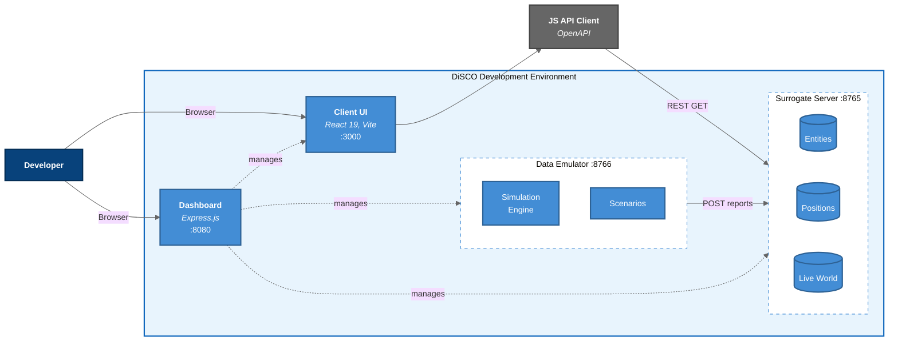
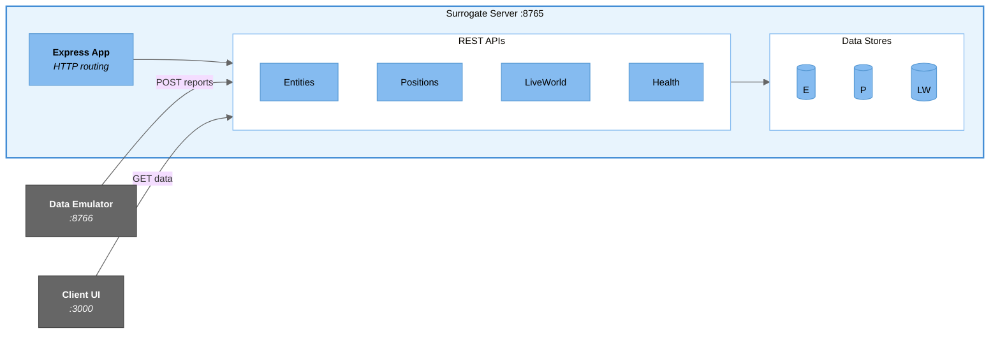
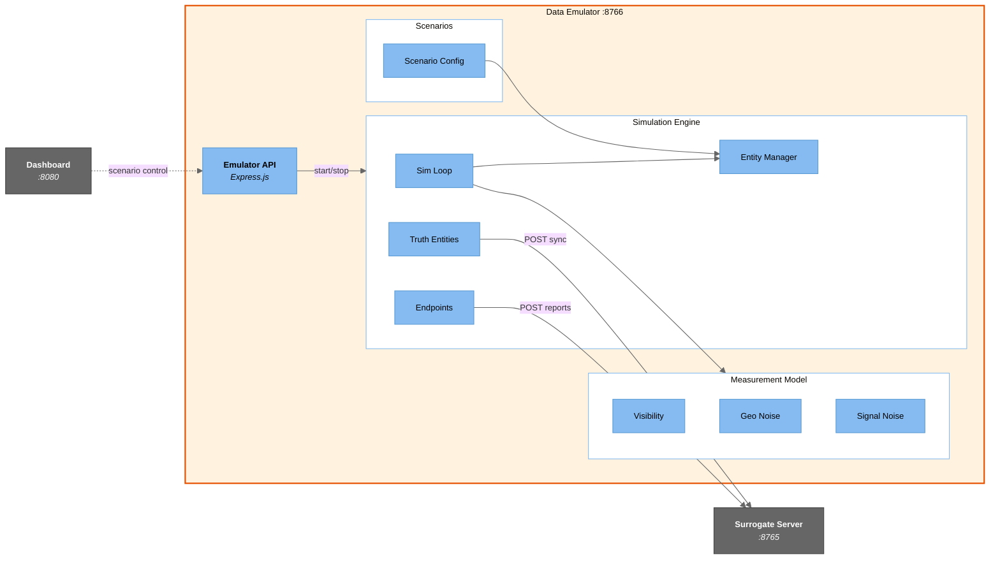
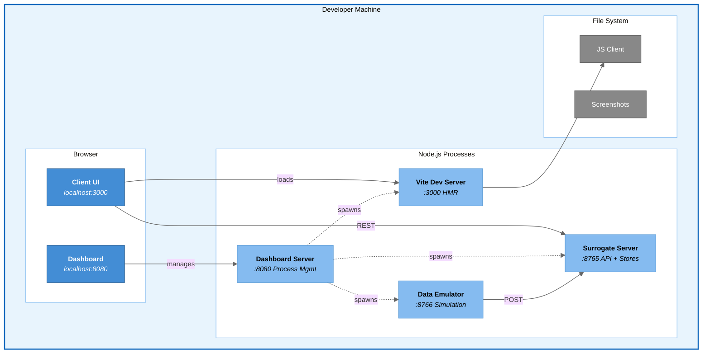

# DiSCO C4 Architecture Diagrams

C4 model diagrams showing the DiSCO development environment at four levels of abstraction.

## Level 1: System Context Diagram

Shows DiSCO in its broader context - the people who use it and the systems it interacts with.

## Level 2: Container Diagram

Shows the four services and how they communicate.

## Level 3: Component Diagram - Surrogate Server

Shows the internal components of the Surrogate DiSCO Server (port 8765).

## Level 3: Component Diagram - Client UI

Shows the internal components of the Client UI application.

## Level 3: Component Diagram - Data Emulator

Shows the internal components of the Data Emulator (port 8766).

## Deployment Diagram

Shows how the system is deployed for local development.

## Summary: C4 Levels

| Level | Diagram | Audience | Shows |
|-------|---------|----------|-------|
| **1 - Context** | System Context | Everyone | DiSCO dev environment in relation to real DiSCO and users |
| **2 - Container** | Container | Developers | Four services (Dashboard, Server, Emulator, Client) and their interactions |
| **3 - Component** | Component (x3) | Developers | Internal structure of Server, Client, and Emulator |
| **4 - Code** | (See ERD) | Developers | Data structures and relationships |

## Key Architectural Decisions

1. **Three-Service Architecture**: Dashboard (8080) orchestrates Surrogate Server (8765), Data Emulator (8766), and Client UI (3000) as independent processes

2. **Emulator is Server-Agnostic**: The emulator POSTs reports to a configurable target URL, working with the surrogate server locally or a real DiSCO server remotely

3. **Separate Truth from Observations**: The simulation maintains "truth data" (actual entity positions) separate from "observations" (what endpoints report with noise)

4. **API Compatibility**: The surrogate server implements the same REST API as production DiSCO, enabling seamless transition to real infrastructure

5. **In-Memory Storage**: Development uses in-memory stores instead of a database for simplicity and fast iteration

6. **Idle-Start Emulator**: The emulator starts without a running simulation; users select a scenario via the dashboard before data flows
