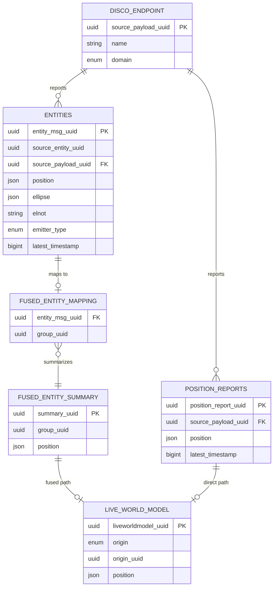
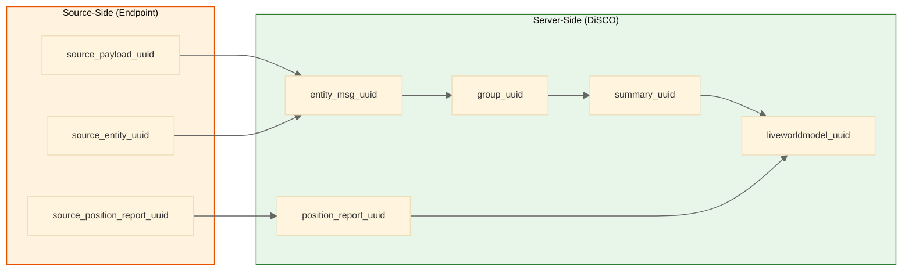
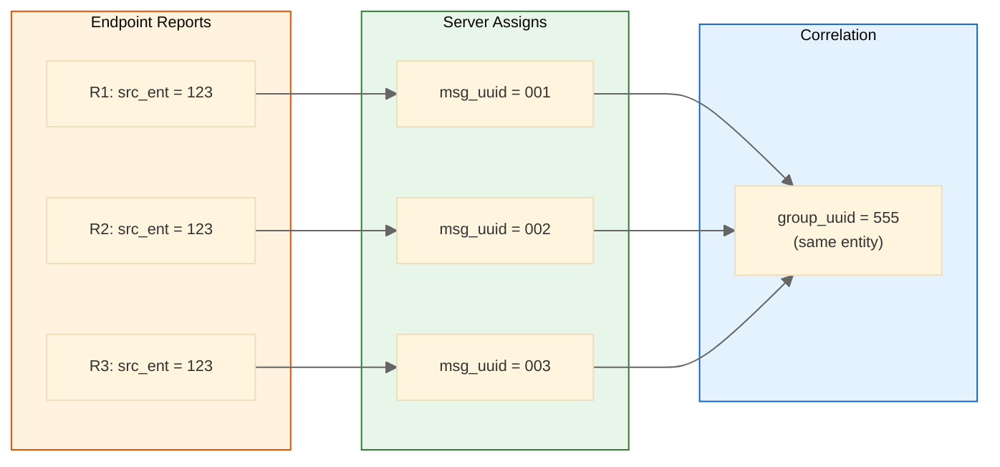
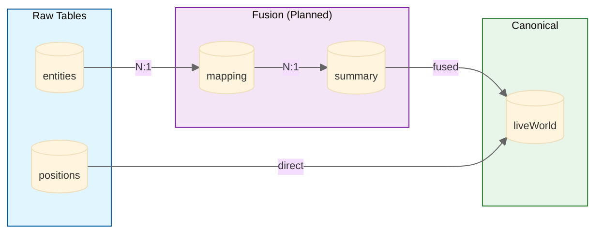
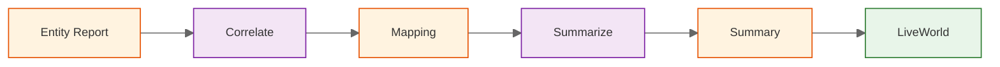
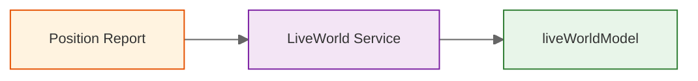

# DiSCO Data Architecture - Entity Relationship Diagram

This document shows the database table relationships and UUID system in DiSCO.

## Entity Relationship Diagram

Shows key fields only. See Implementation Status section for complete field documentation.

## UUID System Explained

DiSCO uses **two UUID namespaces** to track data provenance:

### Why Two UUID Systems?

**Critical Insight**: The server assigns a **NEW** `entity_msg_uuid` for every incoming entity report, regardless of the `source_entity_uuid`.

**Reasons:**
1. **Server cannot trust endpoint correlation** - Some endpoints track entities internally (smart), others report every observation as unique (simple)
2. **Correlation is server-side** - The fusion service uses signal characteristics and geolocation to determine which reports belong together

## Table Relationships Detail

### Relationship Cardinalities

| Relationship | Cardinality | Description |
|--------------|-------------|-------------|
| DISCO_ENDPOINT → ENTITIES | 1:N | One endpoint generates many entity reports |
| DISCO_ENDPOINT → POSITION_REPORTS | 1:N | One endpoint generates many position reports |
| ENTITIES → FUSED_ENTITY_MAPPING | 1:1 | Each entity report maps to exactly one group |
| FUSED_ENTITY_MAPPING → FUSED_ENTITY_SUMMARY | N:1 | Many reports summarize to one group |
| FUSED_ENTITY_SUMMARY → LIVE_WORLD_MODEL | N:1 | Multiple summaries (historical) → one live world row |
| POSITION_REPORTS → LIVE_WORLD_MODEL | N:1 | Multiple position reports → one live world row per endpoint |

## Data Flow Paths

### Fused Path (Entity Reports → Live World)

**Status:** PLANNED - Not yet implemented

### Direct Path (Position Reports → Live World)

**Status:** ✓ IMPLEMENTED

## Implementation Status

| Table | Status | Notes |
|-------|--------|-------|
| `entities` | ✓ Implemented | Stores raw entity reports from endpoints |
| `positionReports` | ✓ Implemented | Stores endpoint self-locations |
| `liveWorldModel` | ✓ Implemented | Currently shows truth data directly |
| `fusedEntityMapping` | Planned | Correlation service output |
| `fusedEntitySummary` | Planned | Summarization service output |

## Key Design Principles

1. **Historical Data**: `fusedEntitySummary` creates a NEW row on each update (not in-place update) enabling forensic analysis and track reconstruction

2. **Dual Origin**: Live World Model tracks whether each entry came from fusion (`fused_entity_summary`) or direct reporting (`position_report`)

3. **Server-Side Correlation**: The server determines which reports belong together, independent of what endpoints think

4. **Data Provenance**: `group_uuid` enables drill-down from live world → summary → raw entity reports
