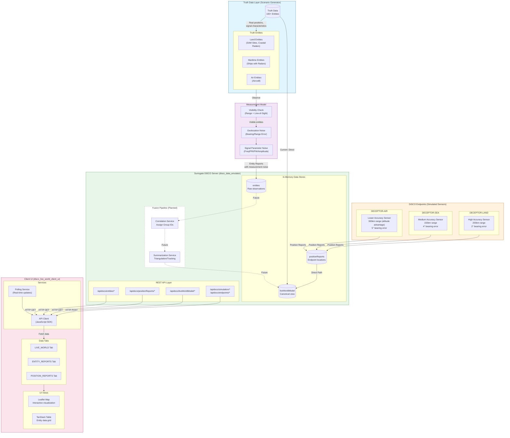
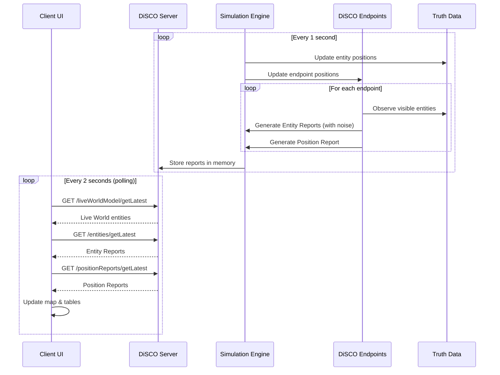

# DiSCO System Architecture Diagram

This diagram shows how the Client UI, Surrogate DiSCO Server, and Truth Data Scenario Generator work together.

## System Overview Flowchart

## Data Flow Summary

### Current Implementation (Solid Lines)

1. **Truth Data → Live World (Direct)**: Truth entities are directly visible in the Live World Model for development/testing
2. **Endpoints → Position Reports → Live World**: Endpoint self-locations flow directly to Live World
3. **Truth Entities → Measurement Model → Entity Reports**: Endpoints observe truth entities through visibility checks and noise models

### Future Implementation (Dashed Lines)

1. **Entity Reports → Correlation → Summarization → Live World**: The fusion pipeline will correlate observations from multiple endpoints and triangulate fused positions

## Component Responsibilities

| Component | Responsibility | Port |
|-----------|---------------|------|
| **Client UI** | Visualization, user interaction | 3000 |
| **Surrogate Server** | Data simulation, API serving | 8765 |
| **Truth Data Generator** | Realistic entity simulation | (internal) |
| **Measurement Model** | Sensor noise simulation | (internal) |
| **DiSCO Endpoints** | Simulated EW sensors | (internal) |

## Communication Patterns

