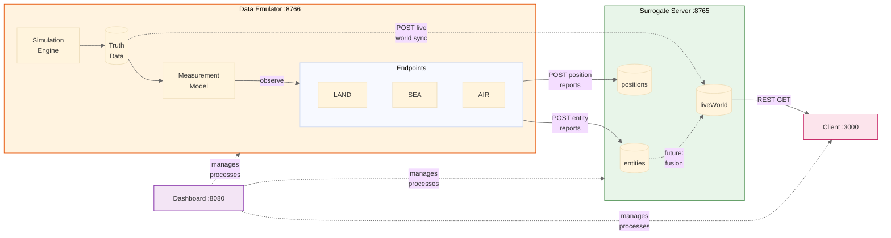
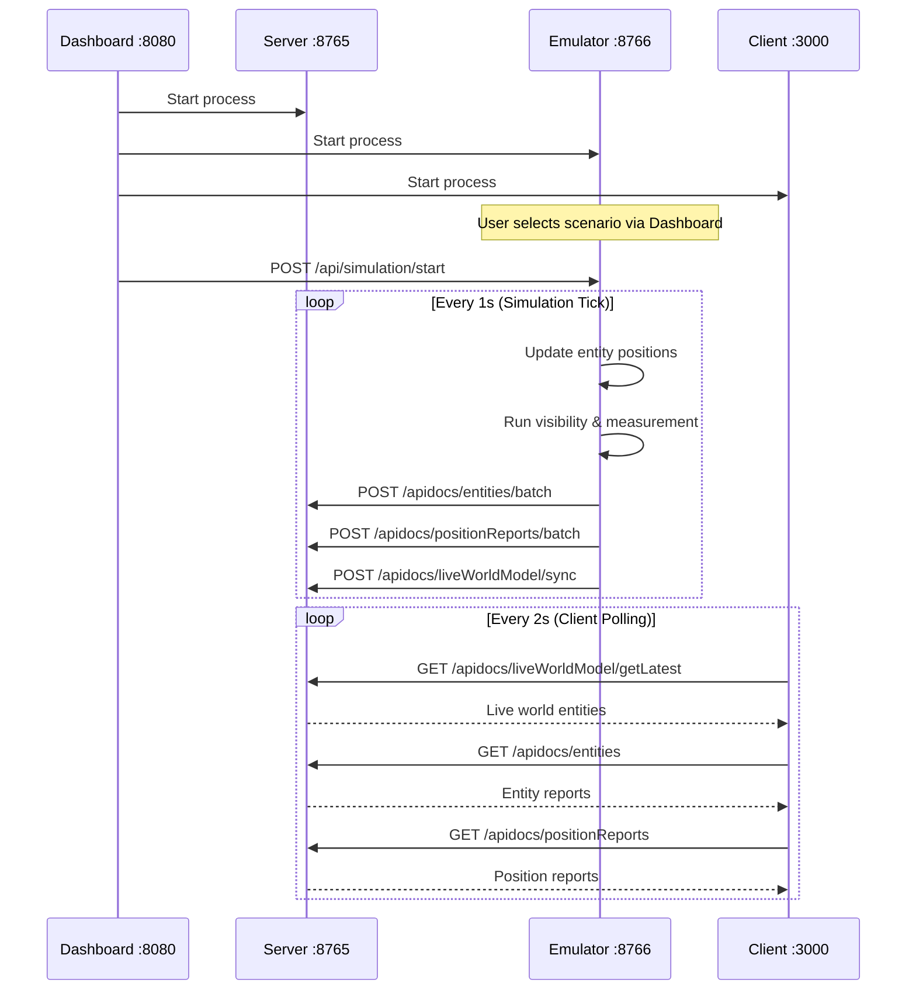

# DiSCO System Architecture Diagram

This diagram shows how the Orchestration Dashboard, Surrogate Server, Data Emulator, and Client UI work together.

## System Overview Flowchart

## Data Flow Summary

### Current Implementation (Solid Lines)

1. **Emulator → Server**: Entity reports and position reports are POSTed via HTTP (realistic path, same as real endpoints)
2. **Emulator → Server (Truth Sync)**: Live world truth data is pushed via batch sync endpoint (development shortcut)
3. **Server → Client**: Client polls REST endpoints for live world, entity reports, and position reports

### Future Implementation (Dashed Lines)

1. **Entity Reports → Correlation → Summarization → Live World**: The fusion pipeline will correlate observations from multiple endpoints and produce fused positions

## Component Responsibilities

| Component | Responsibility | Port |
|-----------|---------------|------|
| **Orchestration Dashboard** | Process management, scenario selection, service monitoring | 8080 |
| **Surrogate Server** | API serving, data stores (entities, positions, live world) | 8765 |
| **Data Emulator** | Scenario simulation, endpoint generation, report submission | 8766 |
| **Client UI** | Visualization, user interaction | 3000 |

## Communication Patterns

