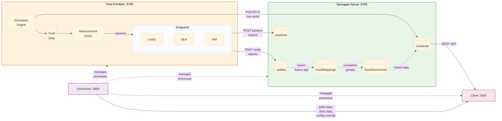
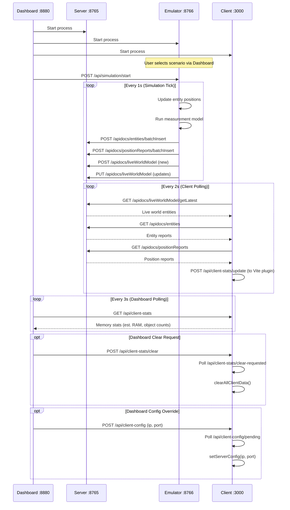

# DiSCO System Architecture Diagram

This diagram shows how the Orchestration Dashboard, Surrogate Server, Data Emulator, and Client UI work together.

## System Overview Flowchart

## Data Flow Summary

### Current Implementation (Solid Lines)

1. **Emulator → Server**: Entity reports and position reports are POSTed via HTTP (realistic path, same as real endpoints)
2. **Emulator → Server (Truth Sync)**: Live world truth data is pushed via POST (new records) / PUT (updates) using server-assigned UUIDs
3. **Server → Client**: Client polls REST endpoints for live world, entity reports, and position reports
4. **Dashboard → Client**: Dashboard polls client memory stats (estimated RAM, object counts) via Vite dev server plugin, can request data clears, and can override the client's server target (IP/port)

### Future Implementation (Dashed Lines)

1. **Entity Reports → Correlation → Summarization → Live World**: The fusion pipeline will correlate observations from multiple endpoints and produce fused positions

## Component Responsibilities

| Component | Responsibility | Port |
|-----------|---------------|------|
| **Orchestration Dashboard** | Process management, config file selection, service monitoring, client stats display | 8880 |
| **Surrogate Server** | API serving, data stores (entities, positions, fused mappings, fused summaries, live world) | 8765 |
| **Data Emulator** | JSON config loading, simulation engine, endpoint generation, report submission | 8766 |
| **Client UI** | Visualization, user interaction, memory stats estimation, data clear | 3000 |

## Communication Patterns

